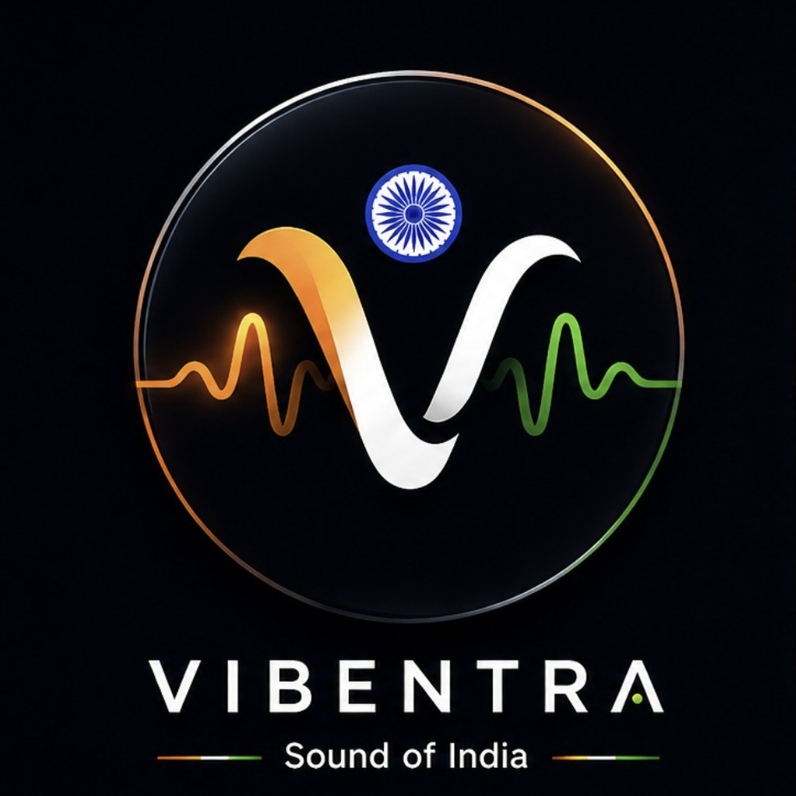
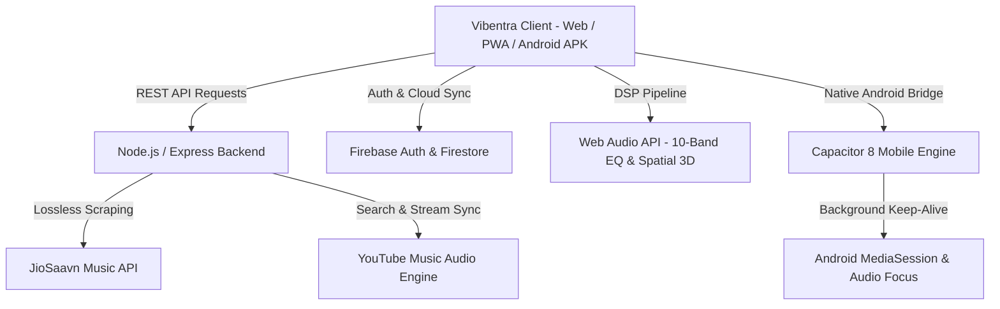

<div align="center">

  

  # 🎵 VIBENTRA
  ### *Where Vibes Connect • Liquid Sound Sanctuary*

  <p align="center">
    <strong>A next-generation high-fidelity music streaming ecosystem with 10-Band Graphic Equalizer, Sound DSP Studio, Smart Sleep Timer, AI DJ Queue Engine, Spotify 2x2 Mosaics, and zero-stutter native background playback.</strong>
  </p>

  <p align="center">
    <a href="https://vibentra.vercel.app/"></a>
    <a href="https://srivatsan-portfolio.vercel.app/"></a>
    <a href="./Portfolio/app-debug.apk"></a>
  </p>

  <p align="center">
    
    
    
    
    
    
  </p>

  ---

  <p align="center">
    <a href="#-key-features">Key Features</a> •
    <a href="#-architecture--tech-stack">Tech Stack</a> •
    <a href="#-getting-started">Getting Started</a> •
    <a href="#-android-apk--pwa-installation">Mobile Installation</a> •
    <a href="#-settings--audio-engine">Settings Engine</a> •
    <a href="#-author--creator">Creator</a>
  </p>

</div>

---

## 🌟 Overview

**Vibentra** is an open-source, ad-free, high-fidelity music streaming ecosystem engineered from the ground up to solve mobile background playback constraints and deliver a breathtaking liquid glass user experience.

Streaming across multi-source audio aggregators (JioSaavn, YouTube Music, and global charts), Vibentra combines audiophile-grade DSP controls, personalized custom themes, harmonic smart queue generation, and seamless cross-platform execution on Web, PWA, and Native Android.

---

## 🚀 Key Features

### 🎛️ 1. Sound & DSP Studio (v1.9.0)
* **10-Band Graphic Equalizer**: Studio-grade hardware-accelerated Web Audio parametric filtering with live sliders (32Hz to 16kHz) and custom audio curve presets (*Bass Boost*, *Vocal Clarifier*, *Rock*, *Pop*, *Electronic*, *Acoustic*).
* **Sub-Bass Drive Booster**: Interactive `0 dB` to `+15 dB` low-frequency drive enhancer.
* **3D Spatial Virtualizer**: 0% to 100% soundstage stereo widener for immersive headphone listening.
* **Master Tempo & Pitch Control**: Alter playback speed from `0.5x` to `2.0x` with real-time pitch preservation lock.

### 🌙 2. Smart Sleep Timer & Automation
* **Preset & Custom Countdowns**: Quick 1-tap sleep presets (`15m`, `30m`, `45m`, `60m`, `90m`) and direct custom minute entry.
* **Stop After Current Track Finishes**: Seamlessly finishes the currently playing song before triggering graceful audio shutdown.
* **Smooth 30s Volume Fade-Out**: Linearly ramps down master audio volume during the final 30 seconds to prevent abrupt waking.
* **Live Dynamic Status**: Active countdown badge with instant 1-tap timer cancellation.

### 🤖 3. AI DJ & Smart Engine
* **Harmonic Queue Auto-Generation**: Automatically sequences tracks with matching acoustic key signatures, energy, and BPM tempo.
* **Mood Sensitivity Selector**: Dynamic discovery presets (*Balanced Dynamic*, *High Energy*, *Chill & Ambient*, *Deep Focus*).
* **AI Real-Time Multilingual Lyrics Translation**: Real-time translation of synced lyrics into English, Tamil, Hindi, Spanish, French, German, and Japanese.

### 🕵️ 4. Listening History & Incognito Privacy Hub
* **Incognito / Private Session**: Temporary private listening mode with zero logging to history, top stats, or recommendation algorithms.
* **Pause History Toggle**: Suspends history tracking on demand.
* **1-Click Local Data Backups**: Export and restore your complete library, playlists, and settings in clean JSON format.
* **Search Cache Purge**: Instant cache wiping with zero lingering queries.

### 💽 5. Vinyl Turntable Studio & Ringtone Trimmer
* **Interactive 33⅓ RPM Turntable**: Rotating vinyl disc with fluid tonearm needle gliding physics and ambient light reflections.
* **Ringtone Studio**: Select custom start positions and slice `15s`, `30s`, or `45s` lossless ringtones directly to your device storage.

### 🖼️ 6. Spotify-Style 2x2 Mosaic Playlists
* **Dynamic 4-Quadrant Mosaics**: Automatically compiles 2x2 artwork mosaics from the top 4 songs in any playlist.
* **Hero Header Metadata**: Large fluid action bars, total duration calculation, and 1-tap shuffle play.

### ⚡ 7. Screen-OFF Persistence & Capacitor Android Bridge
* **Zero-Stutter Background Audio**: Native Android service bridge in Capacitor and active WebAudio keep-alive worker preventing browser background throttling.
* **Full MediaSession Integration**: Rich notification drawer controls, lock screen artwork streaming, and headphone media button hooks.

---

## 🛠️ Architecture & Tech Stack



### 🧩 Technologies Used

| Tier | Technologies |
| :--- | :--- |
| **Frontend Core** | HTML5, Vanilla CSS3 (Custom Design Tokens, Glassmorphism, CSS Grid/Flexbox), JavaScript ES6+ (Modular) |
| **Backend & APIs** | Node.js, Express.js REST API, Multi-Provider Media Aggregator |
| **Audio Engine & DSP** | HTML5 Audio, Web Audio API (BiquadFilterNode 10-Band EQ, ConvolverNode, DynamicsCompressorNode) |
| **Database & Auth** | Firebase Authentication (Email/Password & Google Sign-In), Cloud Firestore, LocalStorage State Cache |
| **Mobile Runtime** | Capacitor 8 Android Native Bridge, Progressive Web App (PWA) Service Worker |
| **Deployment** | Vercel Edge Global CDN, GitHub Actions |

---

## 🚀 Getting Started

### 📋 Prerequisites
* [Node.js](https://nodejs.org/) (v16.0.0 or higher)
* [npm](https://www.npmjs.com/) (v8.0.0 or higher)
* Android Studio (optional, only if compiling native APK from source)

---

### 📥 1. Clone the Repository
```bash
git clone https://github.com/srivatsan2007/Vibentra.git
cd Vibentra
```

---

### 🔧 2. Backend Server Setup
```bash
cd backend
npm install
npm run start # or node server.js
```
*The backend API server will start on `http://localhost:5000`.*

---

### 🌐 3. Frontend Web App Setup
You can serve the frontend with any static web server (e.g. VS Code Live Server, `serve`, or `http-server`):

```bash
# Install serve globally if you haven't already
npm install -g serve

# Run frontend
cd ../frontend
serve -s . -p 3000
```
*Open `http://localhost:3000` in your browser.*

---

## 📱 Mobile Installation & APK

### 🤖 Direct Android APK Installation
1. Download the latest debug build: [**`app-debug.apk`**](./Portfolio/app-debug.apk).
2. Open the downloaded file on your Android device and tap **Install**.
3. *If prompted, enable "Allow installation from unknown sources" in your device settings.*

### 📲 Progressive Web App (PWA)
1. Open [**`https://vibentra.vercel.app/`**](https://vibentra.vercel.app/) in Chrome (Android) or Safari (iOS).
2. Tap the browser menu (**⋮** or Share button) ➡️ Select **"Install App"** or **"Add to Home Screen"**.
3. Enjoy a full-screen, native standalone app experience!

---

## 🎛️ 15+ Advanced Settings Hub

| Category | Features Included |
| :--- | :--- |
| 👤 **Account** | Profile avatar customizer, QR sharing, password management, session tokens. |
| 🎨 **Interface & Themes** | 7+ Presets (*Midnight Purple*, *Ocean Blue*, *Forest Green*, *Sunset Orange*, *Cherry Red*, *Cyberpunk*, *Vibentra Tricolor*) + Custom Hex Theme Studio. |
| 🔋 **Battery Saver** | Pure `#000000` AMOLED dark theme, GPU shader disablement, low-battery auto triggers. |
| 🌐 **Content & Languages** | Regional languages (*Tamil, Telugu, Hindi, Malayalam, Kannada, Punjabi, English*), 320kbps audio quality picker, explicit content filters. |
| 🎵 **Playback** | Gapless audio playback toggle, Crossfade duration slider (`0s` to `12s`), Autoplay similar recommendations, Stop on app exit. |
| 🕵️ **History & Privacy** | Incognito private session mode, Pause history recording, Clear playback cache, Clear search queries. |
| 🤖 **AI & Smart Engine** | AI DJ voice announcements, smart harmonic queue builder, mood sensitivity sliders, real-time lyrics translation. |
| 🌙 **Sleep Timer** | Automated countdowns (`15m`–`90m`), stop after current track finishes, 30s smooth volume ramp-down. |
| 🎛️ **Sound & DSP Studio** | 10-Band Graphic Equalizer, Sub-Bass Boost slider (`+15 dB`), 3D Spatial Virtualizer, `0.5x`–`2.0x` speed control with pitch preservation lock. |
| 🔔 **Notifications & Lock Screen** | Full-res lock screen artwork, rich media controls, live synced lyrics in notification subtitles. |
| 💾 **Storage & Cache** | Complete JSON export/restore backup manager, playlist migration tools. |
| 🔄 **Check for Updates** | Over-the-air update checker, changelog viewer, third-party licenses modal. |

---

## 👨‍💻 Author & Creator

<div align="center">

  

  ### **SRIVATSAN R**
  *Full-Stack Software Engineer & Audio Systems Architect*

  <p align="center">
    <a href="https://srivatsan-portfolio.vercel.app/"></a>
    <a href="https://github.com/srivatsan2007"></a>
    <a href="https://vibentra.vercel.app/"></a>
  </p>

</div>

---

## 📄 License

This project is licensed under the **MIT License** — see the [LICENSE](LICENSE) file for details.

---

<div align="center">
  <sub>Built with ❤️ by <strong>SRIVATSAN R</strong> • Where Vibes Connect.</sub>
</div>
